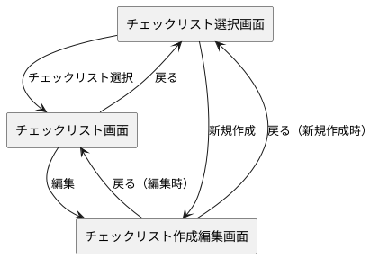
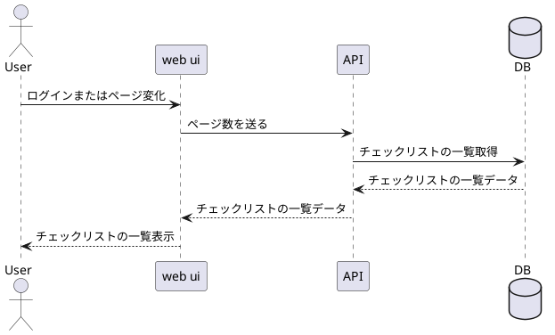
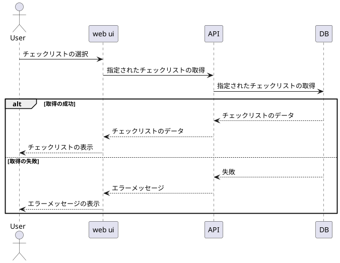
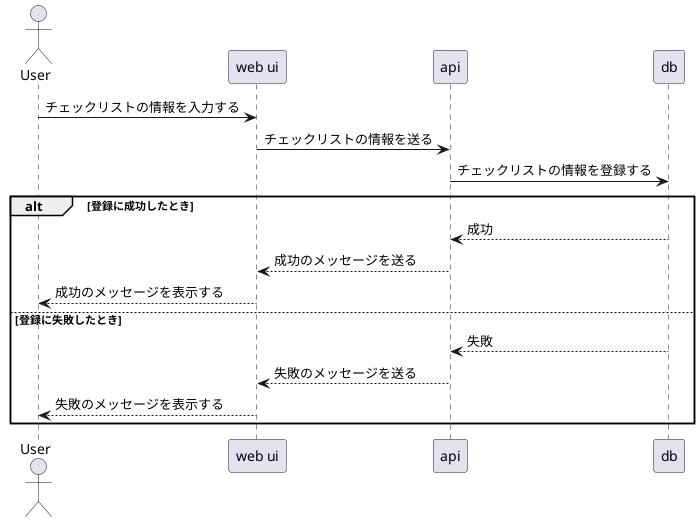
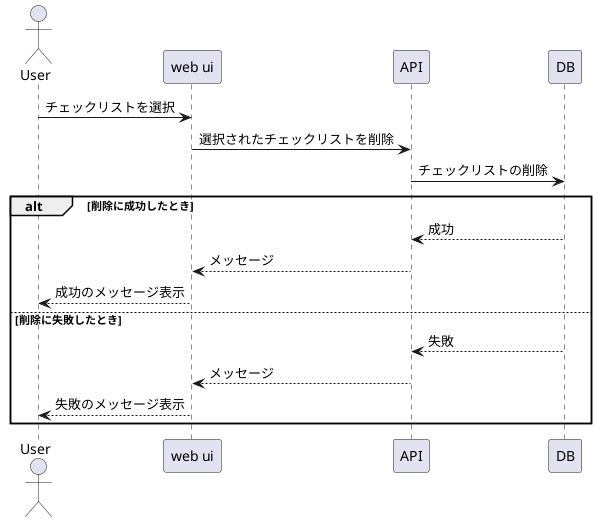

# 画面構成
1. チェックリスト選択画面
2. チェックリスト画面
3. チェックリスト作成編集画面

# 画面遷移図


# シーケンス
## 一覧取得


## チェックリスト表示時


## 追加・編集時


## 削除


# API設計
## チェックリスト一覧取得
### リクエスト
* HTTPメソッド：GET
* URL：/List
```
{
    "page":"1",
}
```
### レスポンス
* ステータス：200
```
{
    "list":[
        {"selected_check_list_id":"1", "check_list_name":"name"},
        {"selected_check_list_id":"2", "check_list_name":"name"},
        {"selected_check_list_id":"3", "check_list_name":"name"},
    ]
}
```
## チェックリスト取得
* HTTPメソッド：GET
* URL：/SelectedCheckList
```
{
    "selected_check_list_id":"1",
    "check_list_name":"name",
    "check_list_info":[
        {"key_1":"項目1"},
        {"key_2":"項目2"},
        {"key_3":"項目3"},
    ]
}
```

## 追加・編集
* HTTPメソッド：PUT
* URL：/NewCheckList
```
{
    "selected_check_list_id":"1", // 新規追加の時は空文字にする
    "check_list_name":"name",
    "check_list_info":[
        {"key_1":"項目1"},
        {"key_2":"項目2"},
        {"key_3":"項目3"},
    ]
    "status":"0" // 0なら新規追加で1なら編集
}
```

## 削除
* HTTPメソッド：DELETE
* url：/UnnecessaryCheckList
```
{
    "unnecessary_check_list_id":"1"
}
```

# データ構造
* DB名：check_list_table
* カラム：
  * id serial primary
  * check_list_name text not null
  * check_list text not null
**具体的なチェックリストはjson文字列で持つようにする**